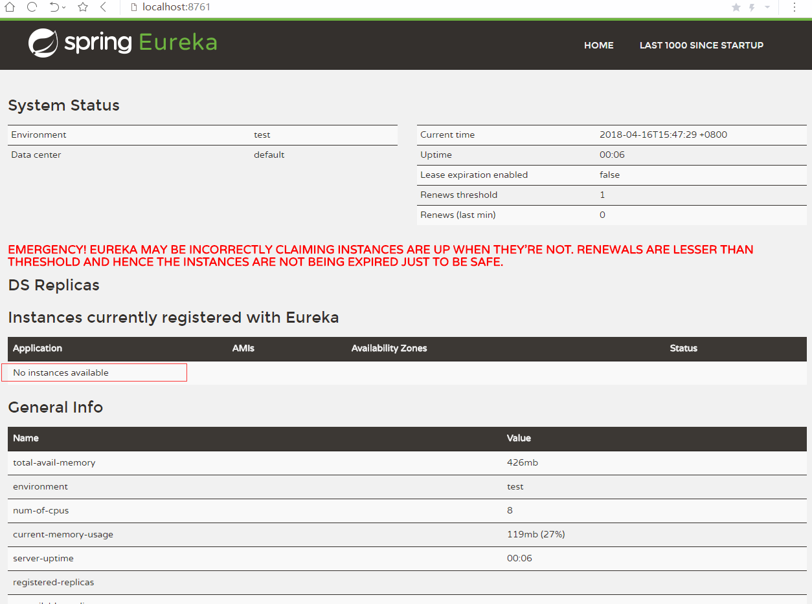
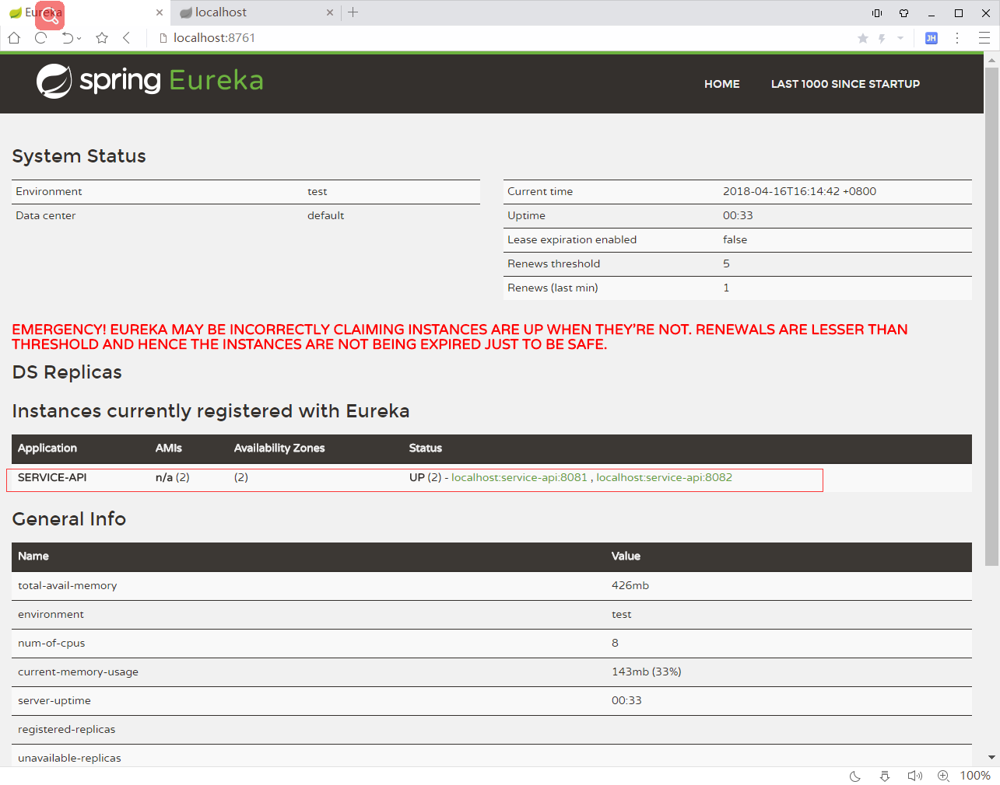
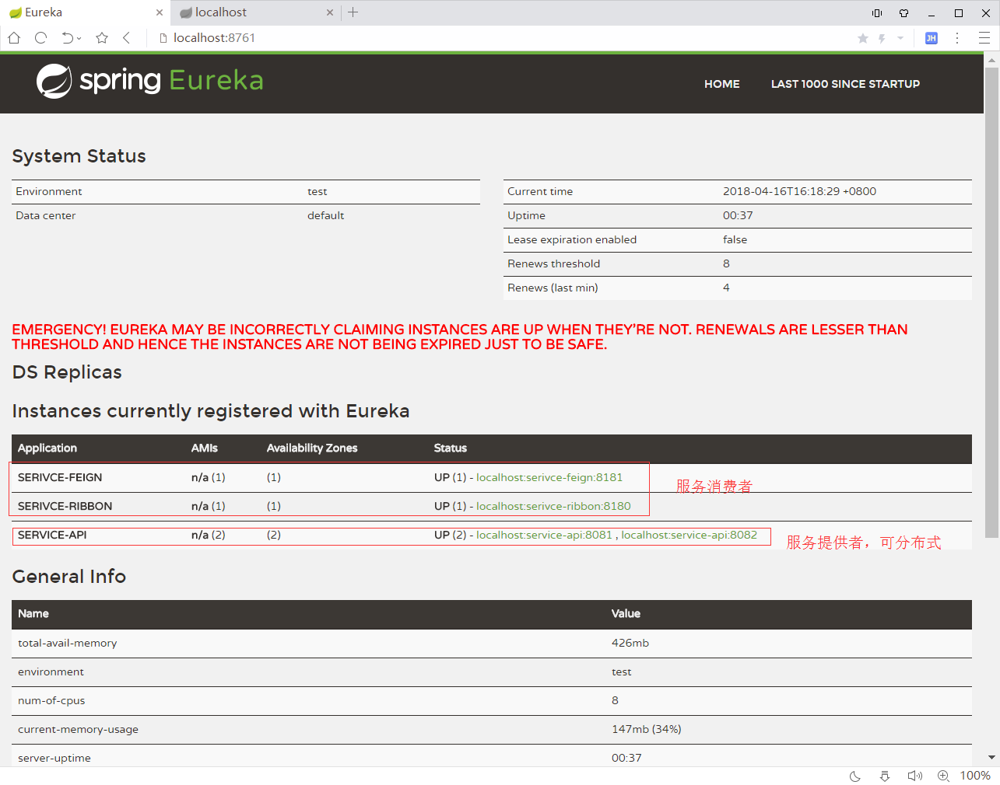
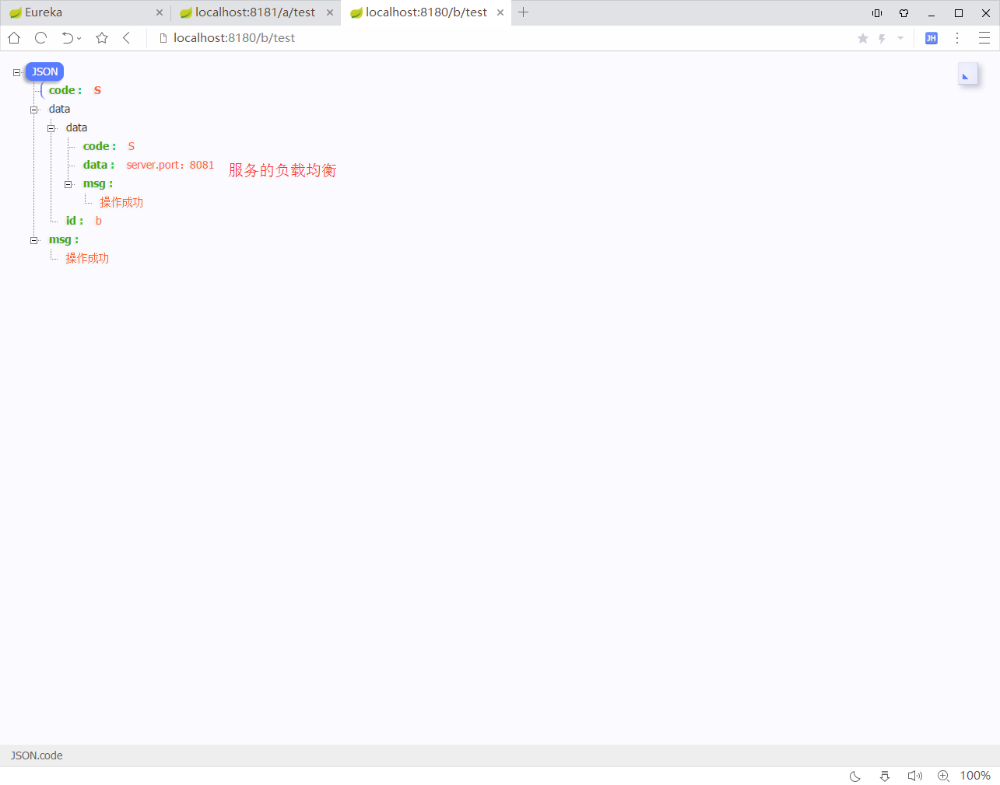

# springcloud 简单运用 demo

#### module说明

| module                    | 名称                 | 说明                           |
|:-------------------------:|:------------------:|:----------------------------:|
| springcloud-eureka-server | 服务注册中心             | springcloud 所有服务的注册中心，相当于通告栏 |
| springcloud-eureka-client | 服务提供者              | 提供服务                         |
| springcloud-ribbon        | 服务消费者（rest+ribbon） | 消费服务                         |
| springcloud-feign         | 服务消费者（feign）       | 消费服务【集成riboon】               |

#### 使用

1. 启动springcloud-eureka-server，访问http://localhost:8761/

   如下，还没有服务

   
2. 启动一个服务提供者 springcloud-eureka-client

   启动之后再刷新服务中心即可看到新的服务，我这里启动了2个服务提供者->8081和8082

   
3. 启动服务消费者  springcloud-feign或springcloud-ribbon

   
4. 然后使用api起访问。因为用ribbon进行了负载均衡，会轮流的调用SERVICE-API**：8081和8082两个端口的/api/test接口；

